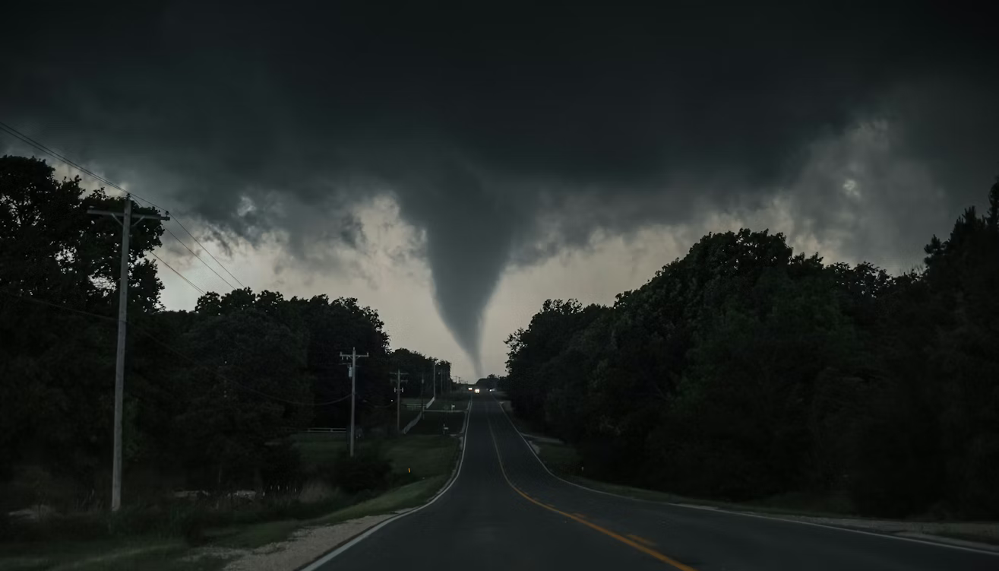

<p align="center">
  
</p>

<h1 align="center">🌪️ Tornado Alley Evaluation</h1>

<h2 align="center">
  An analysis of U.S. tornado frequency, severity, and impact
</h2>


<h2 align="center">🌪️ Overview</h2>
<p>Welcome to my project! As a weather fanatic, I have always been interested in severe weather. After some thought and consideration, I have decided to answer the main question: "Is tornado alley shifting eastward?"</p>

This project explores tornadoes across the United States from 2004 up until 2024. To identify long-term trends while filtering out yearly "noise," the data is polled once per decade: **2004, 2014, and 2024.** We will investigate:
* Which states have the highest tornado frequency.
* Which regions experience the most severe tornadoes.
* Physical characteristics like EF status, path length/width, and time of day/year.
* Are the number of tornadoes increasing over the past few decades?
* Are some states (In particular, eastward ones) seeing an increase of tornadoes?


<h2 align="center"> 🎯 Project Goals</h2>
The primary objective of this project is to demonstrate a full data science workflow:

1.  **Data Cleaning:** Handling raw meteorological records.
2.  **Transformation:** Standardizing formats across three different decades.
3.  **Aggregation:** Summarizing data by state and intensity.
4.  **Visualization:** Creating maps and charts using Python and `pandas`.


<h2 align="center"> 📂 Data Structure</h2>
The data utilized in this project is organized as follows:

* **`data/Cleaned_Tornado_Data/`**: A processed CSV file used for analysis, containing all three decadal data points combined and standardized.
* **`data/Raw_Tornado_Data/`**: Original, unmodified CSV files obtained from **NOAA** (The National Oceanic and Atmospheric Administration).


<h2 align="center">🛠️ Project Directory</h2>

```
project_root/
├── Assets/
│   ├── Tornado_banner.png               # Tornado Banner for README.md
│   └── Tornado_ERD.jpeg                 # Entity Relationship Diagram
├── Data/
│   ├── Cleaned_FEMA_Data/
│   │   └── FEMA_data_cleaned.csv
│   ├── Cleaned_Tornado_Data/
│   │   ├── eastern_state_notation.csv
│   │   └── tornado_all_years_cleaned.csv
│   ├── Raw_FEMA_Data/
│   │   └── FEMA_Declarations.csv        # FEMA disaster declarations
│   └── Raw_Tornado_Data/
│       ├── tornado_2004_raw_data.csv
│       ├── tornado_2014_raw_data.csv
│       └── tornado_2024_raw_data.csv
├── Graphs/                              # Generated charts and maps
├── Notebooks/
│   ├── Tornado_data_exploration.ipynb   # Notebook for data analysis
│   ├── FEMA_data_exploration.ipynb      # FEMA data cleaning notebook
│   └── Tornado_SQL_database.ipynb       # SQL database notebook
├── Tornado_SQL_database/
│   └── tornado_alley.db                 # SQLite database
├── .gitignore
├── README.md
└── requirements.txt                     # Requirements file
```

<h2 align="center"> 🚀 How to Run the Analysis</h2>

Follow these steps to set up the environment and replicate the analysis on your local machine.

### **1. Clone the Repository**
Open your terminal or command prompt and run:
```bash
git clone https://github.com/GregMiles054/Tornado_alley_evaluation.git
```
### **2. Create and Activate a Virtual Environment**

To keep project dependencies isolated, create and activate a Python virtual environment.

**Create the virtual environment:**
```bash
python -m venv .venv
```

**Activate the virtual environment:**
For Windows (Powershell in VS Code)
```bash
.venv\Scripts\Activate.ps1
```
For Windows (Git Bash in VS Code)
```bash
source .venv/Scripts/activate
```
For macOS / Linux (VS Code terminal)
```bash
source .venv/bin/activate
```

**Please make sure to do this before installing depedencies in the step below!!**


### **3. Install dependencies and requirements**
Open your terminal and run:
```bash
pip install -r requirements.txt
```

### **4. Run the Data cleaning notebooks**
```bash
Run Tornado_data_exploration.ipynb **first** to generate the analysis and the tornado_all_years_cleaned_csv. This will also prepare data to be used within SQLite. After that notebook has ran, **secondly,** please run FEMA_data_exploration.ipynb to generate clean and prepare data tailored to SQLite, this data includes FEMA assistance during tornado events. **Lastly,** run the Tornado_SQL_database.ipynb to generate the SQL database, that creates an indepth evaulation of data. The notebooks contain some brief overview, but the data is mainly picked apart within that final notebook.
```

# <h2 align="center">⚠️ <span style="color:red; font-size:50px;">DISCLAIMER</span></h2>
### **Some parts of this project employ the use of ClaudeAI to automate tasks. The ideas are my own work and an explanation is provided regarding how the code works.**